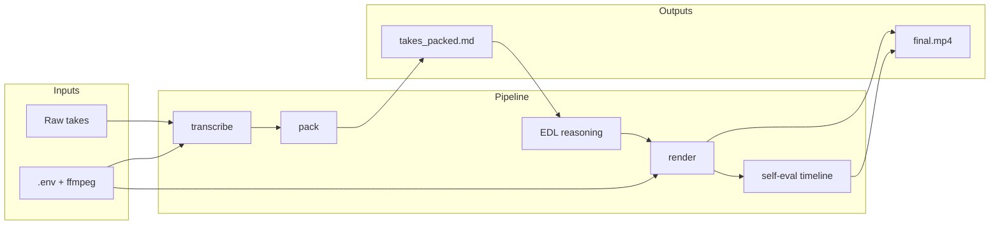
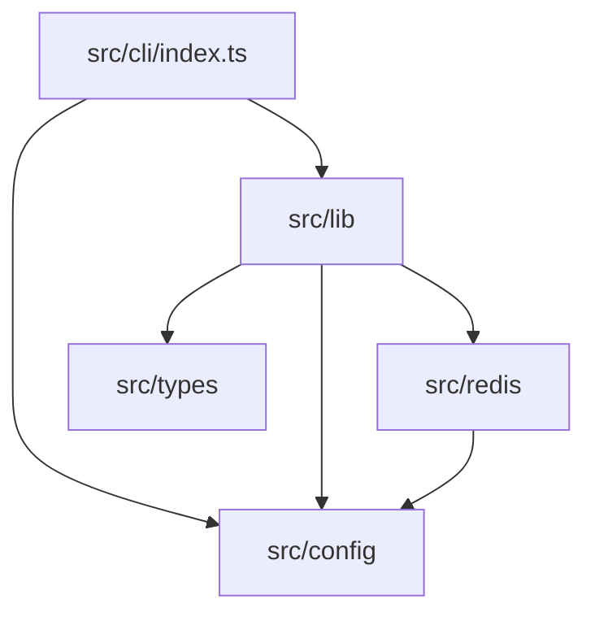
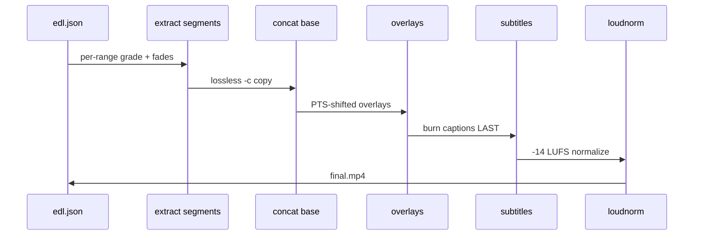

# video-use

Conversation-driven video editing for AI agents. Transcribe raw footage with ElevenLabs Scribe, pack phrase-level transcripts, reason over an EDL, render with ffmpeg, and self-evaluate cut boundaries — all through a typed Node.js CLI.

## Overview

video-use gives an LLM structured text (word-level transcripts) plus on-demand visual composites instead of dumping video frames. An agent reads `takes_packed.md`, proposes a cut strategy, writes `edl.json`, and renders `final.mp4` into `<videos_dir>/edit/`.



## Features

- **Word-level Scribe transcription** with speaker diarization, audio events, and per-file caching
- **Phrase packing** — silence-aware markdown optimized for LLM token efficiency
- **EDL render pipeline** — per-segment grade, 30 ms audio fades, HDR tone-map, overlay compositing, subtitle burn-in last
- **Timeline composites** — filmstrip + waveform PNGs for cut-point drill-down
- **Optional Redis cache** — cross-session transcript persistence when enabled
- **Strict TypeScript** — shared libraries, Vitest tests, ESLint flat config

## Installation

### Prerequisites

| Requirement | Notes |
|-------------|-------|
| Node.js 18+ | Required for the CLI |
| ffmpeg / ffprobe | Hard requirement for all media operations |
| ElevenLabs API key | Scribe transcription ([get a key](https://elevenlabs.io/app/settings/api-keys)) |
| Redis 6+ | Optional; enable with `REDIS_ENABLED=true` |

### Setup

```bash
git clone https://github.com/browser-use/video-use ~/Developer/video-use
cd ~/Developer/video-use
npm install
npm run build
cp .env.example .env
# Edit .env — set ELEVENLABS_API_KEY
```

Register the skill with your agent (symlink the repo into your skills directory). See [install.md](./install.md) for agent-specific steps.

### Agent setup prompt

```text
Set up https://github.com/browser-use/video-use for me.
Read install.md first, then SKILL.md for daily usage.
Use npx video-use for all editing commands.
```

## Configuration

Copy `.env.example` to `.env`:

| Variable | Default | Description |
|----------|---------|-------------|
| `ELEVENLABS_API_KEY` | — | Required for transcription |
| `LOG_LEVEL` | `info` | `debug`, `info`, `warn`, or `error` |
| `REDIS_ENABLED` | `false` | Enable Redis transcript cache |
| `REDIS_URL` | `redis://127.0.0.1:6379` | Redis connection URL |
| `REDIS_KEY_PREFIX` | `video-use:` | Key namespace prefix |
| `REDIS_DEFAULT_TTL_SECONDS` | `86400` | Cache TTL (24 h) |

Verify Redis connectivity:

```bash
npx video-use redis ping
```

## CLI reference

```bash
npx video-use transcribe <video> [--edit-dir <dir>] [--num-speakers N]
npx video-use transcribe-batch <videos_dir> [--workers 4]
npx video-use pack --edit-dir <dir> [--silence-threshold 0.5]
npx video-use timeline <video> <start> <end> [-o out.png]
npx video-use render <edl.json> -o final.mp4 [--preview] [--build-subtitles]
npx video-use grade <input> -o output [--preset warm_cinematic]
npx video-use redis ping
```

Run `npx video-use --help` for full option lists.

## Project structure

```
video-use/
├── src/
│   ├── cli/           # Commander entry point
│   ├── config/        # env + logger
│   ├── lib/           # ffmpeg, scribe, pack, grade, render, timeline
│   ├── redis/         # connection manager + cache
│   └── types/         # shared TypeScript interfaces
├── tests/             # Vitest unit tests
├── docs/AUDIT.md      # internal architecture audit
├── SKILL.md           # agent editing instructions
├── install.md         # first-time setup guide
└── skills/manim-video/  # vendored animation skill
```



## Development

```bash
npm install
npm run dev -- --help          # run CLI via tsx without building
npm run typecheck              # tsc --noEmit (strict)
npm run lint                   # ESLint
npm run test                   # Vitest
npm run build                  # emit dist/
npm run validate               # all of the above
```

### Render pipeline order



## Testing

```bash
npm run test
```

Tests cover phrase packing logic and Redis manager lifecycle (disabled-mode paths). Integration tests against ffmpeg and Scribe are intentionally manual — they require external services and burn API credits.

## Troubleshooting

### `ELEVENLABS_API_KEY not found`

Ensure `.env` exists at the repo root with a non-empty key, or export the variable in your shell.

### `ffmpeg failed with exit code`

Confirm `ffmpeg` and `ffprobe` are on `PATH` and support libx264. Run `ffprobe -version`.

### Redis ping fails

Set `REDIS_ENABLED=true` and confirm Redis is running locally (`redis-cli ping` → `PONG`).

### Subtitles hidden behind overlays

Subtitles must be applied last in the filter chain (Hard Rule 1 in SKILL.md). Use `npx video-use render` — it enforces this order.

### HDR footage looks oversaturated after render

The render pipeline detects PQ/HLG sources and applies tone-mapping automatically. If issues persist, probe with `ffprobe -show_entries stream=color_transfer`.

## FAQ

**Does the LLM watch the video?**
No. It reads packed transcripts (~12 KB per hour of takes) and requests timeline PNGs only at decision points.

**Where do session outputs go?**
Always `<videos_dir>/edit/` — never inside the video-use repo.

**Can I skip Redis?**
Yes. Redis is off by default. Filesystem caching in `edit/transcripts/` is always used.

**What animation engines are supported?**
HyperFrames, Remotion, Manim, and PIL sequences — see SKILL.md. Each renders inside `edit/animations/slot_<id>/`.

**How do I update the skill?**
`git pull` in the clone; re-run `npm install && npm run build` if dependencies changed.

## Contributing

1. Fork and clone the repository
2. Create a feature branch
3. Run `npm run validate` before opening a PR
4. Follow existing TypeScript conventions (strict mode, ESM imports with `.js` extensions)

See [SKILL.md](./SKILL.md) for production editing rules and [docs/AUDIT.md](./docs/AUDIT.md) for architecture notes.

## License

MIT — see [LICENSE](./LICENSE).
